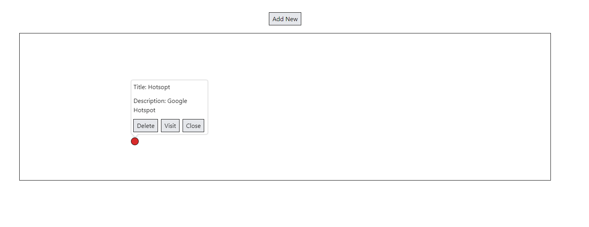

# Hotspot-Manage-Application



## Tasks

Build a hotspot managing application
(https://interactive-img.com/blog/image-hotspots-for-websites)

- User should be able to add a new hotspot by clicking "Add New" button and opening a new modal
  Input Fields: X Position (%), Y Position (%), Product Title, Product Description, Link
- While clicking the hotspot, tooltip (Product Title, Product Description, Close Button, Delete Button, Visit Button) should be displayed around the hotspot
  Close Button: Tooltip needs to hidden
  Delete Button: Hotspot needs to be removed
  Visit Button: Open the link of the hotspot in a new page

## Environment

- Windows 11
- Node v20.15.1
- Npm 10.7.4

## Tech stacks

- Vite + React + Typescript
- Express
- Tailwind CSS
- Reactjs-Popup

## Steps to run program

1. Install node modules

   ```shell
   npm install
   ```

2. Run project
   ```shell
   npm run dev
   ```
   This will host the project on http://localhost:5173.
